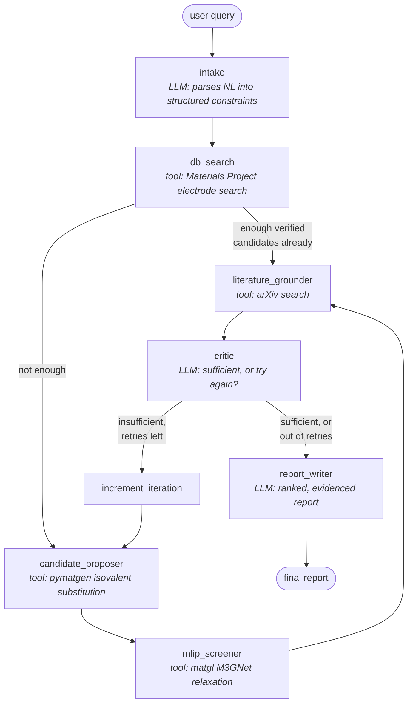

# Battery Electrode Screening Agent

A LangGraph multi-agent system that screens candidate battery electrode materials.
Give it a plain-language target ("a Li-ion cathode above 3.5V that doesn't use
cobalt") and it searches Materials Project's real, DFT-computed electrode data,
proposes new candidates by isovalent substitution when nothing existing fits,
screens those proposals for physical stability with a local ML interatomic
potential, checks arXiv for whether anyone has actually studied them, and loops
back for another round if the results are too thin, instead of answering from a
database with no judgment about whether the answer is actually good.

Built for the Agentic AI Bootcamp capstone, applied to a real materials-informatics
problem rather than a generic business use case.

## Why this problem, why this architecture

The dominant pattern in AI-driven materials discovery right now (GNoME, A-Lab,
the current wave of universal ML potentials) is **generate → screen → validate →
refine**, not a single lookup. That loop is why this project reaches for LangGraph
instead of a simpler linear CrewAI-style pipeline: LangGraph can route back to an
earlier node based on what a later one decided, which is what an actual refine
loop needs and a straight pipeline cannot express.

## Architecture



Two real conditional edges, not one straight line:

1. **After `db_search`**: if Materials Project alone already has enough
   DFT-verified candidates, `candidate_proposer` and `mlip_screener` never run at
   all. No reason to spend a relaxation on a composition that already has real
   ground-truth data.
2. **After `critic`**: the actual cycle. An LLM judges whether the candidate set
   is good enough; if not, and a retry budget remains, the graph loops back to
   `candidate_proposer` with the previously-tried elements excluded, so a retry
   explores new chemistry instead of regenerating the same rejected candidates.
   A hard, deterministic `max_iterations` cap always wins over the LLM's
   preference, so a model that kept asking for "one more round" can never turn
   this into an unbounded loop. Both branches are proven by
   `tests/test_graph_routing.py`, which drives the compiled graph with a fake LLM
   and fake tools and asserts the exact node call counts each branch should
   produce.

### Agent roles and prompt design

| Node | Type | Job | Why an LLM (or not) |
|---|---|---|---|
| `intake` | LLM, structured output | Plain language → `ConstraintsOutput` (working ion, application, element include/exclude, voltage/capacity bounds) | Genuine language understanding is needed: "doesn't use cobalt" has to become `elements_exclude=["Co"]`, keyword matching can't do that reliably. |
| `db_search` | tool | Queries Materials Project's real `electrodes` endpoint | No LLM involved, a direct, typed API call. |
| `candidate_proposer` | tool (rule-based) | Isovalent element substitution on a parent framework | Deliberately **not** an LLM or a generative model: every proposed composition traces back to one explainable substitution rule (same-period transition-metal swap, or same-group main-group swap), not a black box. |
| `mlip_screener` | tool | Relaxes proposed structures with a local universal ML potential | No LLM, a numerical calculation. |
| `literature_grounder` | tool | Searches arXiv, scoped to materials-science categories | No LLM; see the arXiv precision note below. |
| `critic` | LLM, structured output | Judges whether the candidate set actually answers the request | A fixed threshold can't tell "one converged, physically plausible candidate" from "one converged, borderline-implausible candidate," that's a judgment call, bounded by the hard `max_iterations` guardrail described above. |
| `report_writer` | LLM | Writes the final ranked, evidenced, honest report | Turning heterogeneous structured data (MP fields, MLIP energies, arXiv hits) into prose a person reads is exactly what an LLM is for; every input is real data assembled by the graph, not invented by the model. |

System prompts for each LLM node live directly in `agent/nodes/*.py`, next to the
node that uses them, not in a separate prompts file, so the prompt and the code
that consumes its output never drift apart.

## What was actually verified before being written, and two real bugs it caught

Every tool in this project was run against something real before the graph was
built around it, not written from documentation and assumed to work:

- **Materials Project's `electrodes` endpoint** was confirmed real by introspecting
  the installed `mp-api` client's `ElectrodeRester`/`InsertionElectrodeDoc` schema
  directly (`working_ion`, `average_voltage`, `capacity_grav`, `stability_charge`,
  `stability_discharge`, `max_delta_volume`, `host_structure` are all real,
  present fields). A second finding, `battery_id`, the rester's own nominal
  `primary_key`, is **not** an actual field on the document. The tool was written
  to build its own id from `material_ids` (a field confirmed present) instead of
  trusting an attribute that couldn't be verified populated.
- **MACE**, the state-of-the-art universal potential this project was originally
  scoped around, failed to install: its `matscipy` dependency needs a C compiler
  toolchain via a Meson build, which errored with `metadata-generation-failed` on
  the development machine. `matgl`'s `M3GNet-PES-MatPES-PBE-2025.2` was substituted,
  pure PyTorch, no compiler dependency, and confirmed relaxing a real structure
  end to end (model load ~5s, relaxation ~1.5s) before `mlip_relax.py` was written.
- **A real chemistry bug**, caught by testing: the first substitution heuristic
  used "same periodic group" for every element, which is right for main-group
  elements (Li → Na → K) but wrong for transition metals, it missed the textbook
  Fe → Mn → Ni olivine cathode family entirely, since those sit in the same
  *period*, not the same group. Fixed to branch on block, and locked in by
  `tests/test_tools_substitution.py::test_transition_metal_substitution_finds_real_olivine_family`.
- **A real API precision bug**: arXiv's plain keyword search for "cathode" returns
  hollow-cathode plasma-physics papers (an entirely different subfield) ahead of
  battery materials papers. Fixed by scoping every query to the
  `cond-mat.mtrl-sci` category by default, confirmed directly, unscoped search
  returned plasma physics, category-scoped search returned genuine battery
  materials papers including a real, current (2026) paper on ML+DFT voltage
  screening.
- **Semantic Scholar**, the original literature source, was dropped after its
  keyless tier returned HTTP 429 on repeated live attempts, a real, shared-pool
  rate limit, not a fluke. arXiv has no such problem and was used instead.

## Observability

- **Structured logging** (`observability/logging_config.py`): every node logs
  through Python's `logging` module with level, timestamp, and source, not `print`.
- **LangSmith tracing**: set `LANGCHAIN_API_KEY` (get one free at
  [smith.langchain.com](https://smith.langchain.com)) and every LLM call and every
  tool call is traced automatically. Tool functions (`materials_project`,
  `arxiv_search`, `mlip_relax`, `substitution`) are wrapped in `@traceable` so they
  show up as their own named spans in the trace tree, not just the LLM calls
  LangChain auto-instruments. Confirmed as a safe no-op when no key is set, so the
  agent runs identically with or without tracing enabled.

## Project layout

```
agent/
  state.py            # the shared LangGraph state schema
  graph.py             # wires nodes together, the two conditional edges
  llm.py               # chat model factory (Anthropic or OpenAI)
  nodes/               # one file per agent role, see the table above
  tools/               # one file per real tool: MP, arXiv, MLIP relax, substitution
api/
  main.py              # FastAPI app: /health, /query, /query/{job_id}
  jobs.py              # in-memory job store + background execution
  schemas.py
ui/
  app.py               # Streamlit: submit a query, watch the agent's live trace, see results
observability/
  logging_config.py    # structured logging + LangSmith wiring
tests/                 # 16 tests: graph routing, API contract, and every tool
scripts/
  run_demo.py          # a CLI end-to-end run, used for the demo video
```

## Setup

```bash
git clone <this-repo>
cd battery-electrode-screening-agent
cp .env.example .env      # fill in MP_API_KEY and one LLM provider key
pip install -r requirements-dev.txt
```

Required keys:
- `MP_API_KEY`, free at [next-gen.materialsproject.org/api](https://next-gen.materialsproject.org/api)
- `ANTHROPIC_API_KEY` or `OPENAI_API_KEY`, matched by `LLM_PROVIDER`
- `LANGCHAIN_API_KEY`, optional, enables LangSmith tracing

### Run locally

```bash
uvicorn api.main:app --reload --port 8000
# in a second terminal
streamlit run ui/app.py
```

### Run with Docker

```bash
docker compose up --build
```
Opens the API on `:8000` and the UI on `:8501`. The API image pre-downloads the
MLIP at build time so the first real request doesn't wait on a Hugging Face Hub
call.

> **Honest note on this**: `docker compose up` was not run end to end in the
> development environment, its Docker Desktop daemon was not running (a
> pre-existing, unrelated Windows virtualization issue on that machine). Every
> dependency in `requirements.txt`/`requirements-ui.txt` is pinned to a version
> independently confirmed installable and working in this project's actual
> Python environment, and the Dockerfiles use a standard `python:3.11-slim` base
> these packages ship prebuilt wheels for, but the container build itself is the
> one piece of this project not directly verified.

### Run the tests

```bash
pytest tests/ -v
```
16 tests, all passing: graph routing (both conditional branches, including a test
that proves the retry loop terminates at `max_iterations` instead of running
forever), the FastAPI contract (including the auth gate), and every tool, two of
them (`test_tools_mlip_relax.py`, `test_tools_arxiv.py`) as real integration tests
against the live model and the live arXiv API, not mocks.

## API

```
GET  /health
POST /query          {"query": "..."}              -> {"job_id": "...", "status": "pending"}
GET  /query/{job_id}                                -> {"status": ..., "log": [...], "result": {...}}
```
Set `API_AUTH_TOKEN` to require `Authorization: Bearer <token>` on `/query*`;
left unset, the API stays open, the right default for a local demo.

## Known limitations

- The job store is in-memory, single-process. A real multi-instance deployment
  needs Redis or a task queue (Celery/RQ) behind it instead.
- `candidate_proposer`'s substitution rule only covers the elements listed in
  `agent/tools/substitution.py`'s `_ELECTRODE_RELEVANT` pool, a deliberately
  scoped, explainable rule set, not a general materials generative model.
- The MLIP screener estimates relative stability with a fast universal potential,
  it is not a substitute for full DFT, and says so in its own docstring.
